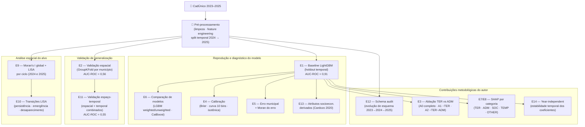

# Pipeline de Predição de Insegurança Alimentar em Dados Administrativos em Evolução

Repositório público do Trabalho de Conclusão de Curso (IC/UFAL, 2026).  
**Autor:** Vitor Magno Gouveia  
**Orientador:** Dr. André Luiz Lins de Aquino  
**Coorientadora:** M.Sc. Keila Barbosa Costa  
**Instituição:** Instituto de Computação — Universidade Federal de Alagoas (IC/UFAL)

---

## Descrição

Este repositório contém o pipeline de predição de insegurança alimentar desenvolvido
como TCC. O trabalho avalia empiricamente a robustez espaço-temporal de um modelo
LightGBM treinado sobre microdados anonimizados do CadÚnico em Alagoas (ciclos 2024
e 2025), decompondo a contribuição de variáveis territoriais diretas (TER) e de
variáveis administrativas territorialmente dependentes (ADM).

---

## Pipeline



---

## Reprodução

### 1. Instalar dependências

```bash
python -m venv .venv
source .venv/bin/activate   # Linux/macOS
.\.venv\Scripts\activate    # Windows
pip install -r requirements.txt
```

### 2. Obter os dados

Os microdados anonimizados do CadÚnico não são distribuídos diretamente neste
repositório por restrições de privacidade (LGPD).

Os dados podem ser acessados em:

```
https://drive.google.com/drive/folders/1sQwPOXon2Nz4FvgBTbP_4aMwpdO9JPZj?usp=sharing
```

Após o download, coloque o arquivo `cadunico_2023_2025_union_anon.csv` em
`data/anon_outputs/`. A estrutura esperada:

```
data/
    anon_outputs/
        cadunico_2023_2025_union_anon.csv
    BR_Municipios_2024/
```

### 3. Executar o pipeline

Abra e execute `04_pipeline_completo_final.ipynb` na ordem das células.

O notebook detecta automaticamente se os artefatos de pré-processamento em cache
(`outputs/notebook1/`) já existem; se não existirem, executa o pré-processamento
completo a partir do CSV.

---

## Estrutura do repositório

```
ppiadaearg/
│
├── 04_pipeline_completo_final.ipynb   Pipeline completo (Experimentos E1–E12)
├── requirements.txt                   Dependências Python com versões fixadas
├── scripts/
│   └── common_pipeline.py             Módulo auxiliar (pré-processamento, treino, métricas)
└── data/
    ├── BR_Municipios_2024/            Shapefile IBGE de municípios brasileiros
    └── anon_outputs/
        └── mapeamento_variaveis_inicial.csv   Classificação TER/ADM/SOC/TEMP/OTHER
```

---

## Referências

ALKIRE, Sabina; FOSTER, James; SETH, Suman; SANTOS, Maria Emma; ROCHE, José Manuel;
BALLON, Paola. *Multidimensional Poverty Measurement and Analysis*. Oxford University
Press, 2015.

BARBOSA COSTA, Keila et al. A Machine Learning Framework for Early Detection of Food
Insecurity Using Administrative Microdata. In: *Anais do CSBC 2026 — LASDigiGov*.
Sociedade Brasileira de Computação, 2026.
Código: <https://github.com/keilabcs/CadUnicoIA>

BARBOSA, Keila; DAMIÃO, Gabriel; MENDES, Wictória; AQUINO, André L. Harmonização
Longitudinal e Dinâmica Espacial da Insegurança Alimentar em Microdados do CadÚnico.
In: *Anais do CSBC 2026 — LASDigiGov*. Sociedade Brasileira de Computação, 2026.
Código: <https://github.com/keilabcs/CadUnico>

CARDOZO, Daniela Vaz; BORGES, Carmen Veiga; DE OLIVEIRA, Marcia Aparecida Ferreira;
BORGES, Selma da Silva. Predictive power of indicators to the perception of food and
nutritional insecurity in the Bolsa Família Program. *Revista Brasileira de Saúde
Materno Infantil*, 2020.

CHRISTENSEN, C.; WAGNER, T.; LANGHALS, B. Year-Independent Prediction of Food
Insecurity Using Classical and Neural Network Machine Learning Methods. *AI*, v. 2,
p. 244–260, 2021.

DELÉGLISE, H.; INTERDONATO, R.; BÉGUÉ, A.; MAITRE D'HOTEL, E.; TEISSEIRE, M.;
ROCHE, M. Food security prediction from heterogeneous data combining machine and deep
learning methods. *Expert Systems With Applications*, v. 190, p. 116189, 2022.

ENDALEW, A. A.; MESHESHA, M.; GETANEH, A. T.; ALEMU, B. T.; TRUWORK, B. A.;
BEYENE, M. Y. Predicting Household-based Emergency Food Assistance using Hybrid
learning with Explainable Artificial Intelligence. In: *ICT4DA 2024*, 2024.

GAITÁN-ROSSI, Pablo et al. Predictors of persistent moderate and severe food
insecurity in a longitudinal survey in Mexico during the COVID-19 pandemic.
*Public Health Nutrition*, 2024.

GHOLAMI, S.; KNIPPENBERG, E.; CAMPBELL, J.; ANDRIANTSIMBA, D.; KAMLE, A.;
PARTHASARATHY, P.; SANKAR, R.; BIRGE, C.; LAVISTA FERRES, J. Food security analysis
and forecasting: A machine learning case study in southern Malawi. *Data & Policy*,
v. 4, p. e33, 2022.

JUNG, W.; KIM, A. H.; STOEFFLER, Q.; GOUDARZI, S.; BENOTSMANE, R.; SHAH, V.
Targeting urban poverty and food insecurity: A community-informed spatial analysis and
machine learning approach. *Sustainable Cities and Society*, v. 134, p. 106799, 2025.

JUNG, W.; BENOTSMANE, R.; STOEFFLER, Q.; KIM, A. H.; GHADIMI, S.; HOSSEINI, M.;
NTARLAGIANNIS, D.; AMMARI, T.; LU, Y.; STEINER, J. Contextualized poverty targeting
with multimodal spatial data and machine learning in Brazzaville, Congo. *Cities*,
v. 170, p. 106429, 2026.

LETTA, Marco et al. Measuring and testing vulnerability to food insecurity for
prediction and targeting. *World Development*, 2025.

MACHEFER, M.; THOMAS, A.-C.; MERONI, M.; VEIGA LOPEZ PENA, J. M.; RONCO, M.;
CORBANE, C.; REMBOLD, F. Potential and limitations of machine learning modeling for
forecasting Acute Food Insecurity. *Global Food Security*, v. 45, p. 100859, 2025.

MORAIS, Dayane de Castro; DUTRA, Luiza Veloso; FRANCESCHINI, Sylvia do Carmo Castro;
PRIORE, Silvia Eloiza. Indicadores de avaliação da Insegurança Alimentar e Nutricional
e fatores associados: revisão sistemática. *Ciência & Saúde Coletiva*, 2020.

QASRAWI, R. et al. Machine learning techniques for the identification of risk factors
associated with food insecurity among adults in Arab countries during the COVID-19
pandemic. *BMC Public Health*, v. 23, p. 1805, 2023.

RIGDON, J.; MONTEZ, K.; PALAKSHAPPA, D.; BROWN, C.; DOWNS, S. M.; ALBERTINI, L. W.;
TAXTER, A. Predicting food insecurity in a pediatric population using the electronic
health record. *Journal of Clinical and Translational Science*, v. 8, p. e195, 2024.

SEMAKULA, H. M. et al. Integrated modelling of the determinants of household food
insecurity during the 2020–2021 COVID-19 lockdown in Uganda. *Agriculture & Food
Security*, v. 13, p. 10, 2024.

WESTERVELD, J. J. L.; VAN DEN HOMBERG, M. J. C.; NOBRE, G. G.; VAN DEN BERG, D. L. J.;
TEKLESADIK, A. D.; STUIT, S. M. Forecasting transitions in the state of food security
with machine learning using transferable features. *Science of the Total Environment*,
v. 786, p. 147366, 2021.

ZHAO, L.; YANG, M.; MIN, S.; QING, P. Prediction of household food insecurity in
rural China: an application of machine learning methods. *International Food and
Agribusiness Management Review*, v. 28, n. 2, 2025.
